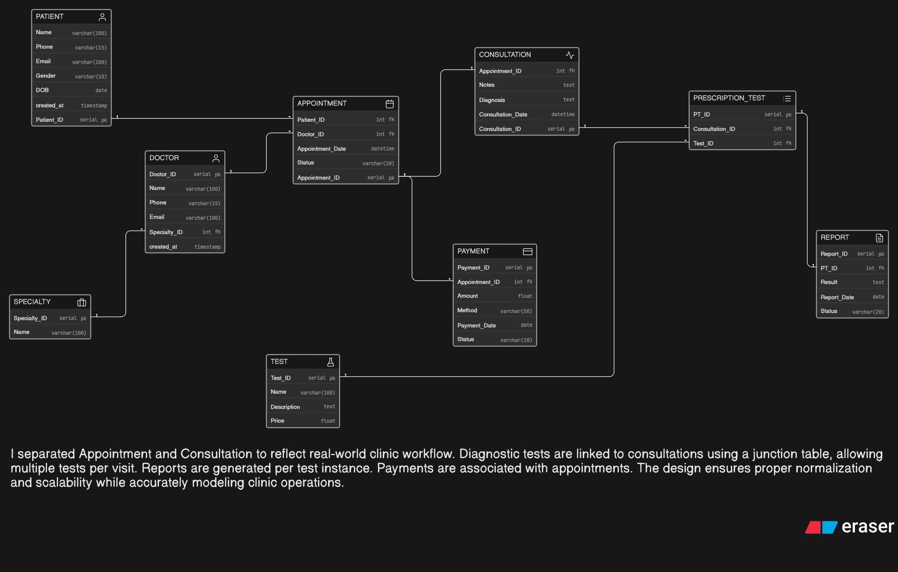

# 🏥 Clinic Management System – ER Diagram

## 📌 Problem Statement

A modern clinic wants to digitize its operations to efficiently manage doctors, patients, appointments, consultations, diagnostic tests, reports, and payments.

Patients should be able to:

* Book appointments with doctors
* Visit for consultations
* Undergo diagnostic tests if prescribed
* Receive reports later

The clinic may have multiple doctors across different specialties, and patients may visit multiple times. The system must maintain a clean flow from appointment to consultation to diagnostics and reporting.

---

## 🎯 Objective

To design a normalized and scalable ER diagram that supports:

* Patient and doctor management
* Appointment booking and tracking
* Consultation records
* Diagnostic test prescriptions
* Report generation
* Payment tracking

---

## 🧠 My Approach

In my approach, I focused on modeling the real workflow of a clinic system.

* I separated **Appointment** and **Consultation** to reflect that not every appointment results in a visit.
* I introduced a **Specialty** entity to organize doctors by their domain.
* I used a junction table **PRESCRIPTION_TEST** to handle multiple tests prescribed during a consultation.
* I linked **Reports** to specific prescribed tests to maintain accurate tracking.
* I connected **Payments** to appointments for billing and transaction tracking.
* I ensured proper use of Primary Keys (PK) and Foreign Keys (FK) for data integrity.

The design is kept simple, practical, and scalable for a real clinic environment.

---

## 🔗 Key Relationships

* One **Patient** can book multiple **Appointments**
* One **Doctor** can attend multiple **Appointments**
* One **Appointment** may lead to one **Consultation**
* One **Consultation** can prescribe multiple **Tests**
* One **Test** can be prescribed in many consultations
* Each prescribed test generates a **Report**
* Each **Appointment** can have associated **Payments**

---

## 🧩 Core Features Modeled

* 👤 Patient & Doctor Management
* 🏷️ Specialty Management
* 📅 Appointment Scheduling
* 🩺 Consultation Records
* 🧪 Diagnostic Test Handling
* 📄 Report Generation
* 💳 Payment Tracking

---

## 🖼️ ER Diagram

---

## 🚀 How to Use

* Open the diagram image to view:

  * Entities and attributes
  * Primary Keys (PK)
  * Foreign Keys (FK)
  * Relationships and cardinality

---

## 📚 Tools Used

* Draw.io (for ER diagram design)
* GitHub (for hosting and submission)

---

## ✅ Conclusion

This ER design models a clinic workflow from appointment booking to consultation, diagnostic testing, and reporting. It ensures a clear separation of responsibilities, proper normalization, and scalability for future expansion.
