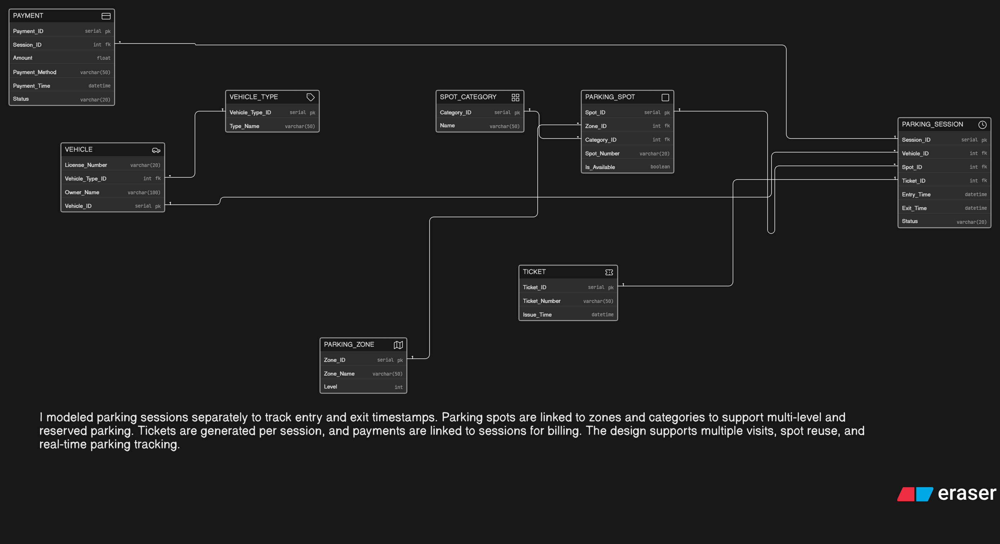

# 🚗 Event Parking Management System – ER Diagram

## 📌 Problem Statement

A large convention venue hosting events like Comic-Con requires a structured parking management system to handle thousands of vehicles arriving over multiple days. Vehicles include bikes, cars, SUVs, cabs, and EVs, and the parking facility is divided into multiple zones and levels.

Certain parking areas are reserved for specific categories such as VIP guests, exhibitors, staff members, cosplayers, and EV charging vehicles.

The system must track vehicle entry and exit, parking spot allocation, ticket generation, session tracking, and payment processing in an organized and scalable way.

---

## 🎯 Objective

To design a normalized and scalable ER diagram that supports:

* Vehicle and vehicle type management
* Parking zone and level organization
* Parking spot allocation and availability tracking
* Reserved parking categories
* Parking sessions with entry and exit tracking
* Ticket generation
* Payment handling

---

## 🧠 My Approach

In my approach, I focused on modeling the real-world workflow of an event parking system.

* I created a **Vehicle** entity linked to **Vehicle Type** to handle different vehicle categories.
* I separated **Parking Zone** and **Parking Spot** to support multi-level and multi-zone parking structures.
* I introduced **Spot Category** to manage reserved parking types such as VIP, staff, and EV charging.
* I used a **Parking Session** entity to track each entry and exit event, allowing a vehicle to visit multiple times.
* I kept **Ticket** separate from sessions to represent issued parking tickets.
* I linked **Payments** to parking sessions to track billing and transaction details.

This design ensures flexibility, scalability, and accurate tracking of parking operations.

---

## 🔗 Key Relationships

* One **Vehicle Type** can have many **Vehicles**
* One **Vehicle** can have multiple **Parking Sessions**
* One **Parking Zone** can contain multiple **Parking Spots**
* One **Spot Category** can apply to multiple **Parking Spots**
* One **Parking Spot** can be reused across multiple sessions
* One **Parking Session** is linked to one **Ticket**
* One **Parking Session** can have associated **Payment**

---

## 🧩 Core Features Modeled

* 🚘 Vehicle & Vehicle Type Management
* 🗺️ Multi-zone & Multi-level Parking
* 🅿️ Parking Spot Allocation
* 🏷️ Reserved Parking Categories (VIP, Staff, EV, etc.)
* 🎫 Ticket Generation
* ⏱️ Entry & Exit Tracking (Sessions)
* 💳 Payment Processing

---

## 🖼️ ER Diagram

*(Replace with your actual PNG file name)*

---

## 🚀 How to Use

* Open the ER diagram image to view:

  * Entities and attributes
  * Primary Keys (PK)
  * Foreign Keys (FK)
  * Relationships and structure

---

## 📚 Tools Used

* Draw.io / Eraser (for ER diagram design)
* GitHub (for hosting and submission)

---

## ✅ Conclusion

This ER design models a real-world event parking system by separating vehicle data, parking infrastructure, session tracking, and payment handling. It supports multiple visits, spot reuse, reserved parking categories, and scalable multi-zone parking management.
