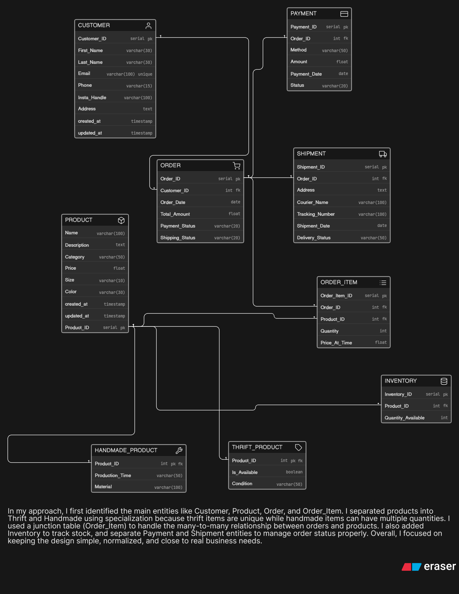

# 🛍️ Instagram-Based Thrift & Handmade Store – ER Diagram

## 📌 Problem Statement

A small creator runs an Instagram-based store selling thrifted fashion items and handmade products. Initially, orders are managed through Instagram DMs and WhatsApp, but as the business grows, there is a need to properly manage:

* Products (thrifted and handmade)
* Inventory (stock availability)
* Customer details
* Orders and order history
* Payment status
* Shipping and delivery tracking

The system must handle both unique thrift items (single piece) and handmade items (multiple units), along with product-specific details like size, color, and condition.

---

## 🎯 Objective

To design a normalized and scalable ER diagram that supports:

* Product management (thrift + handmade)
* Inventory tracking
* Customer and order management
* Payment and shipping tracking
* Real-world business workflow

---

## 🧠 My Approach

In my approach, I first identified the core entities such as Customer, Product, Order, and Order_Item.

I used specialization to divide Product into:

* Thrift_Product → for unique items (single piece)
* Handmade_Product → for items with multiple stock

I implemented a junction table (Order_Item) to resolve the many-to-many relationship between Orders and Products.

I added an Inventory entity to track available stock separately.

I created separate Payment and Shipment entities to manage transaction and delivery details efficiently.

I ensured proper use of Primary Keys and Foreign Keys to maintain relationships and data integrity.

Overall, the design focuses on being:

* Normalized
* Scalable
* Easy to understand
* Close to real-world business logic

---

## 🔗 Key Relationships

* One Customer can place multiple Orders
* One Order can contain multiple Products
* Many-to-many relationship handled using Order_Item
* Each Product has inventory details
* Product is specialized into Thrift and Handmade
* Each Order has associated Payment and Shipment

---

## 🖼️ ER Diagram

---

## 🚀 How to Use

* Open the image to view the complete ER diagram
* The diagram shows:

  * Entities with attributes
  * Primary Keys (PK)
  * Foreign Keys (FK)
  * Relationships and structure

---

## 📚 Tools Used

* Draw.io (for ER Diagram design)
* GitHub (for version control and submission)

---

## ✅ Conclusion

This ER design models a growing Instagram-based business by handling both unique and multi-stock products, while keeping the structure clean and scalable for future expansion.
