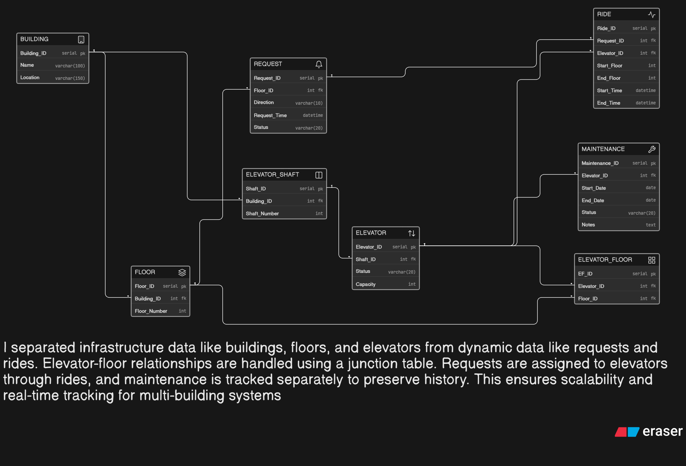

# 🏢 Smart Elevator Control System – ER Diagram

## 📌 Problem Statement

LiftGrid Systems is an infrastructure technology company building intelligent elevator control platforms for large commercial buildings such as corporate towers, malls, airports, hospitals, and high-rise residential complexes.

These buildings operate multiple elevators across many floors, handling thousands of passengers daily. The system must efficiently manage:

* Multiple buildings
* Multiple elevators per building
* Floor-level ride requests
* Elevator assignment and allocation
* Elevator status monitoring
* Maintenance tracking
* Ride history logging

---

## 🎯 Objective

To design a normalized and scalable ER diagram that supports:

* Multi-building infrastructure management
* Elevator and floor mapping
* Ride request handling and allocation
* Elevator usage tracking
* Maintenance history tracking

---

## 🧠 My Approach

In my approach, I focused on separating static infrastructure data from dynamic operational data.

* I created **Building, Floor, and Elevator Shaft** entities to model the physical infrastructure.
* I linked **Elevators to Shafts** and buildings for proper hierarchy.
* I used a junction table **ELEVATOR_FLOOR** to handle the many-to-many relationship between elevators and floors.
* I introduced a **Request** entity to track floor-level ride requests.
* I used a **Ride** entity to assign requests to elevators and log movement history.
* I created a separate **Maintenance** entity to track elevator servicing without overwriting operational data.

This design ensures scalability, real-time tracking, and proper separation of concerns.

---

## 🔗 Key Relationships

* One **Building** has many **Floors**
* One **Building** has many **Elevator Shafts**
* One **Shaft** contains one **Elevator**
* One **Elevator** can serve multiple **Floors**
* One **Floor** can be served by multiple **Elevators**
* One **Floor** can generate multiple **Requests**
* One **Request** is handled by one **Ride**
* One **Elevator** can complete multiple **Rides**
* One **Elevator** can have multiple **Maintenance records**

---

## 🧩 Core Features Modeled

* 🏢 Multi-building infrastructure
* 🛗 Elevator and shaft management
* 🧭 Floor mapping and servicing
* 🔔 Ride request handling
* 🚀 Ride allocation and logging
* 🛠️ Maintenance tracking

---

## 🖼️ ER Diagram

---

## 🚀 How to Use

* Open the ER diagram image to view:

  * Entities and attributes
  * Primary Keys (PK)
  * Foreign Keys (FK)
  * Relationships and structure

---

## 📚 Tools Used

* Draw.io / Eraser (for ER diagram design)
* GitHub (for hosting and submission)

---

## ✅ Conclusion

This ER design models a real-world smart elevator control system by separating infrastructure data from operational data. It supports multiple buildings, efficient ride allocation, maintenance tracking, and scalable system monitoring suitable for high-rise environments.
